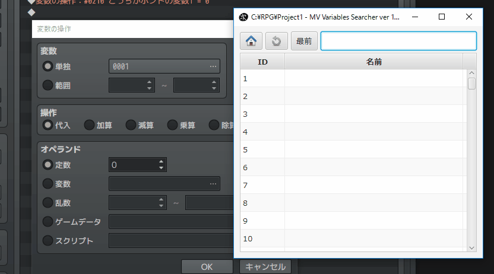

MV Variables Searcher
================================================================================

- バージョン       : 1.0.0
- 作者             : 次郎 (Jiro)
- 作成日           : 2017/05/05
- 最終更新日       : 2017/05/05
- 連絡先           : [次ログ](http://jiroron666.hatenablog.com/)
- 実行ファイル名   : mvvs.jar
- 動作確認・開発環境
  - OS             : Windows 10 Home
  - プロセッサ     : 3.50GHz Intel Core i7-4770K
  - メモリ         : 8GB RAM
  - Javaバージョン : 1.8.0-131

目次
--------------------------------------------------------------------------------

1. [ソフトウェア概要                  ](#ソフトウェア概要)
1. [注意点                            ](#注意点)
1. [ファイル構成                      ](#ファイル構成)
1. [動作条件                          ](#動作条件)
1. [実行方法                          ](#実行方法)
1. [使い方                            ](#使い方)
   1. [ファイルを開く                 ](#ファイルを開く)
   1. [変数データの確認               ](#変数データの確認)
   1. [変数画面を表示(ツクールMV側)   ](#変数画面を表示-ツクールMV側)
   1. [変数の検索                     ](#変数の検索)
   1. [変数を選択                     ](#変数を選択)
   1. [確認                           ](#確認)
1. [ショートカットキー                ](#ショートカットキー)
1. [FAQ                               ](#FAQ)
1. [利用規約                          ](#利用規約)
   1. [補足                           ](#補足)
1. [バージョンアップ方法              ](#バージョンアップ方法)
1. [その他・作者からのお願い          ](#その他・作者からのお願い)
1. [アンインストール方法              ](#アンインストール方法)
1. [更新履歴                          ](#更新履歴)

ソフトウェア概要
--------------------------------------------------------------------------------

このソフトは、ツクールMVの変数のインクリメンタルサーチによって素早くIDを特定して
選択することを目的としたツールです。

変数が大量になってくると、変数の何番に定義したかわからなくなることを解消すること
を目的としています。

また、本ツールは正規表現フィルタリングをサポートしているため、柔軟なフィルタリン
グを可能になっています。

注意点
--------------------------------------------------------------------------------

本ソフトはツクール側の操作にVBScriptを使用しています。

VBScriptはWindows環境にしかないスクリプト言語です。

この事はつまり、**他のOS (Linux, Mac etc)で動作しない**ことを意味します。

Widnwos以外のOSをご利用の方は、Javaで作成しているmvvsを起動することができても、
ツクール側で変数を選択させることができないと思います。

ファイル構成
--------------------------------------------------------------------------------

zip配布時の構成

- CREDIT.txt         : 利用している素材・ライブラリ情報
- README.html        : READMEへのリンク
- java_download.html : Javaアップデート公式サイトへのリンク
- mvvs.jar           : 実行ファイル
- search_vars.vbs    : ツクール側を操作するスクリプト

動作条件
--------------------------------------------------------------------------------

本ソフトを実行するにはJavaがインストールされている必要があります。また、本ソフト
作成時のJavaのバージョン以上がインストーされている必要があります。

もし本ソフトをダブルクリックで実行できなかった場合は、Webブラウザで下記URLの公式
サイトを開くか、同封の java_download.html をダブルクリックして公式サイトを開いて
Javaをインストールまたはアップデートしてください。

[Javaダウンロード](https://java.com)

それでも起動できなかった場合は、お手数ですがFAQの項目を確認した後に、本ドキュメ
ント先頭の連絡先より作者にご報告ください。

実行方法
--------------------------------------------------------------------------------

"mvvs.jar"をダブルクリックしてください。LinuxOSをご使用の方はターミナルから
"java -jar mvvs.jar"と打ち込んでください。

使い方
--------------------------------------------------------------------------------

### ファイルを開く

画面左上のボタンを選択してください。ツクールプロジェクトフォルダを選択する画面が
表示されます。

ツクールのGame.rpgprojectファイルが存在するフォルダを選択してください。

### 変数データの確認

変数が正常に読み込めたかどうか確認します。

画面中央のテーブルに変数名一覧が表示されていれば成功です。

### 変数画面を表示-ツクールMV側

ツクールMVで「変数の操作」ウィンドウ、または「変数の選択」ウィンドウを変数選択画
面を表示してください。

この時、本ソフトを常に前面に表示したい場合は、検索欄の隣のボタンをクリックしてく
ださい。

### 変数の検索

画面右側の検索欄で検索したい文章を入力してください。
それは、変数のIDでも、名前の一部分だけでも絞込を開始します。

### 変数を選択

本祖ソフト側で使用したい変数にダブルクリック、またはEnterキーを押してください。

### 確認

自動でツクール側で変数が選択されます。
正常に期待どおりのデータが選択されていればOKです。

ショートカットキー
--------------------------------------------------------------------------------

| キー           | 動作                   | 備考 |
|:---------------|:-----------------------|:-----|
| J              | ↓に移動               |      |
| K              | ↑に移動               |      |
| Enter          | ツクール側で変数を選択 |      |
| ダブルクリック | ツクール側で変数を選択 |      |

FAQ
--------------------------------------------------------------------------------

### Q1. 実行ファイルをダブルクリックしても動作しない

ご利用の環境にJavaがインストールされているか確認してください。また、Javaがインス
トールされていても、本ソフト作成時のJavaのバージョン以下をご利用の場合、動作しな
い場合があります。

Javaのインストール、アップデート方法については[動作条件](#動作条件)の項目を参照
してください。

### Q2. READMEのレイアウトが崩れている

仕様です。フォントが異なるとレイアウトが崩れて見えることがあります。

メモ帳などでこのドキュメントを開いているのでしたら、書式メニューのフォントからMS
ゴシック(MS Pゴシックではありません)を選択すると作者が期待している通りのレイアウ
ト表示になります。

### Q3. WindowsXXで動かない

申し訳ありません。  
私の手元にWindows10しかないので、本ソフトは他のWindowsをご利用の場合に、正常に動
作することを保証出来ません。

### Q4. 検索中の移動時間が長い

単純な方法で移動していることと、意図的に待ち時間を若干発生させていることに起因し
ます。

search_vars.vbs の先頭の sleepTime の値を 0 にすると高速で動作しますが、固まって
見える場合があります。

### Q5. ツクールの変数名と一致しない

ツクールの変数名を更新した時は、リロードボタンを押して再読込しないと、ソフト側に
反映されません。これは仕様です。

### Q6. ダブルクリックしても動作しない

ツクール側で「変数の操作」ウィンドウを開いているか、「変数の選択」ウィンドウを開
いているか確認してください。

そのどちらかのウィンドウを開いていない状態では、変数を選択できません。

利用規約
--------------------------------------------------------------------------------

- 本ライセンスはApache License Version2.0に基づいています。  
  http://www.apache.org/licenses/LICENSE-2.0

- 本ソフトを利用したことで発生した問題に対して、私は一切の責任を負いません。

- 著作権は私(次郎)が有しています。私が死亡して50年経過するまで決して放棄すること
  はありません。

- 再配布はお控えください。

- 利用規約を事前連絡なしに変更する場合があります。その場合は最新の規約が適用され
  るものとします。

### 補足

利用できる作品

- ツクール用に作成しましたがツクール作品以外の素材作成が目的でも利用可能です。
- 有償作品、エロゲー、グロゲーでも利用可能です。
- ゲーム作品以外でも利用可能です。

利用報告

- READMEへの記載は利用者の任意です。私から強制することはありません。
- 使用報告もしなくて結構です。したいひとだけしてください。

バージョンアップ
--------------------------------------------------------------------------------

本ソフト配布時のzipに同封のREADME.htmlをダブルクリックしてください。本ソ
フトのプログラムを公開しているGithubというサイトにジャンプします。

移動先のサイトに表示されているバージョン情報が、現在ご使用のバージョンよりも上
がっている場合は、移動先サイトの実行ファイルをダウンロードしてご利用ください。

ダウンロード方法がわからなかった場合は、本ソフトをダウンロードしたツクマテコミュ
ニティ・または作者ブログのソフト配布ページのDropboxのリンクから、最新版をダウン
ロードしてください。

その他・作者からのお願い
--------------------------------------------------------------------------------

- バグの報告は連絡先の作者ブログか、ツクマテコミュニティのツール配布のページでお
  願いします。

- 新しい機能の実装のご要望をいただいた場合、実装する場合もあるかもしれませんが、
  必ずではないことをご了承ください。

アンインストール方法
--------------------------------------------------------------------------------

本ソフトはレジストリを変更していませんので、配布時のzipフォルダごとゴミ箱にぶち
込んでいただければアンインストールできます。

更新履歴
--------------------------------------------------------------------------------

Ver1.0.0 : 2017/05/05
- プログラム公開
